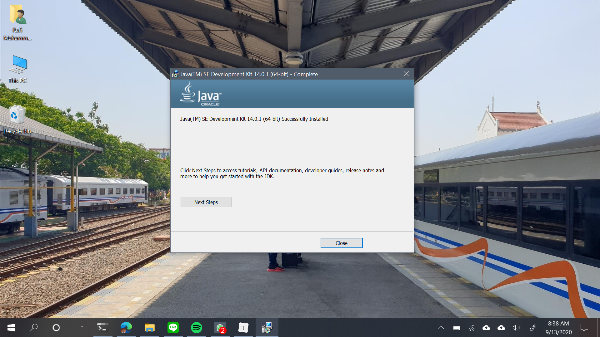
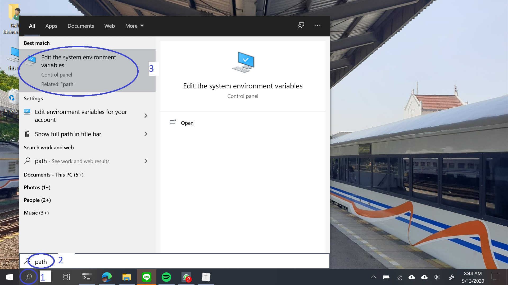
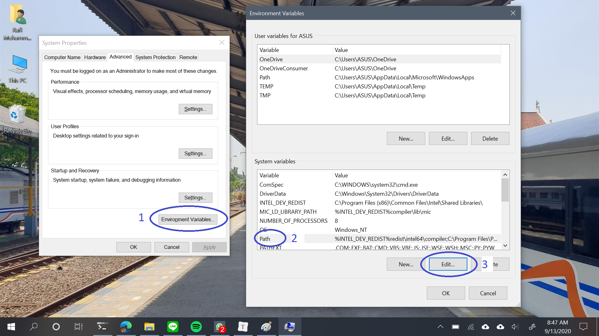
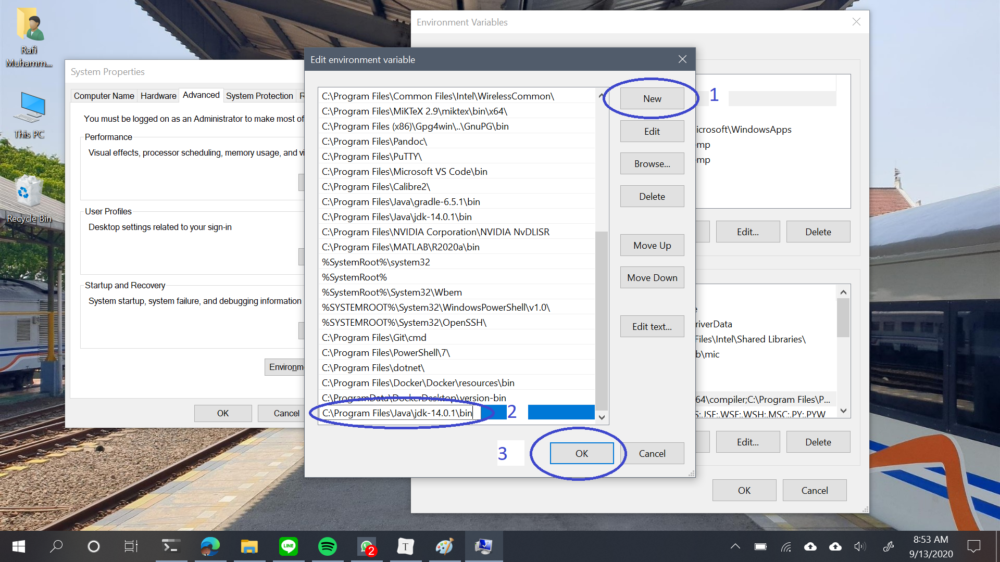

# Installation

## Recipes

In this course, you will need to install some applications. There also some additional tools which could come in handy later on. To minimize conflicts, here are the versions of the tools which we will use in this course:

| Application                        | Status           | Recommended Version        |
| ---------------------------------- | ---------------- | -------------------------- |
| An operating system of your choice | Mandatory (duh?) | Please use 64-bit versions |
| Java Development Kit (JDK)         | Mandatory (duh?) | Latest (\>= 10.0)          |
| Git                                | Mandatory        | Latest (\>= 2.26)          |
| Visual Studio Code                 | Recommended      | Latest                     |
| VSCode Java Extension Pack         | Recommended      | Latest                     |
| VSCode Live Share Extension Pack   | Optional         | Latest                     |

## Java

A Java Development Kit (JDK) installation comes with essential things to develop a Java program. Do note that JDK does not come with an editor like Python with its' IDLE. You will need to write your program in a separate editor.

To get the latest version of JDK, go to Oracle's site (https://www.oracle.com/java/technologies/javase-downloads.html), pick your desired JDK version (latest is better), then choose the correct file for each OS, which is:

- Windows x64 Installer for Windows users
- macOS Installer for macOS users
- Linux Compressed Archive for Linux users (If you use Debian-based distros, it is easier to use Linux Debian Package)

### Installation for Windows

1. Run the installer which you have downloaded previously (make sure you have administrator access or you are the only user). You don't have to change anything during installation.

   

2. After a successful installation, search for "PATH". In Windows 7, 8, and 8.1, the search bar is inside the Start menu/screen. In Windows 10, it is in the taskbar. Choose the recommended result ("Edit the system environment variables").

   

3. Choose "Environment Variables" in the settings window. Then, select "Path" in System Variables. Click "Edit" to modify it.

   

4. Add your Java installation to the Path entry by clicking "New", then typing Java's default installation folder, and clicking "OK".
   > The JDK 14 directory for Windows is (change 14.0.1 to your JDK version if you install a different one):

   ~~~powershell
   "C:\Program Files\Java\jdk-14.0.1\bin"
   ~~~

   

5. Verify that your Java installation is detected by launching a Command Prompt / PowerShell / similar applications.

   > You can use this command to check your JDK version.
   
   ~~~powershell
   java -version
   ~~~
   
   
   
   

## Git

Content under development

## Visual Studio Code

Content under development
