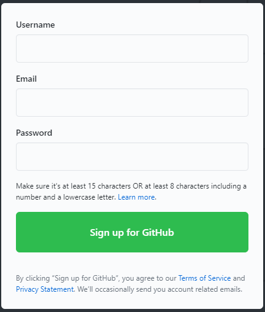
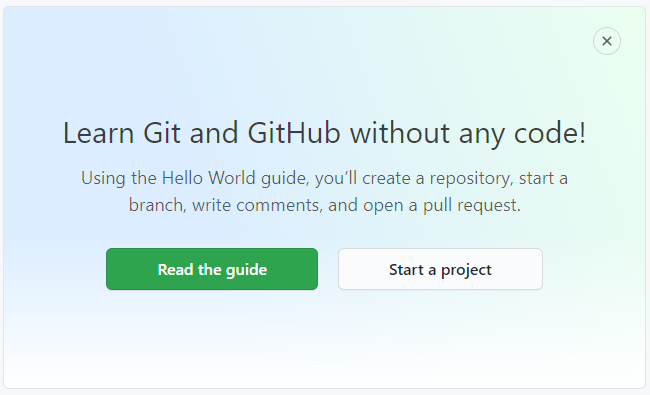
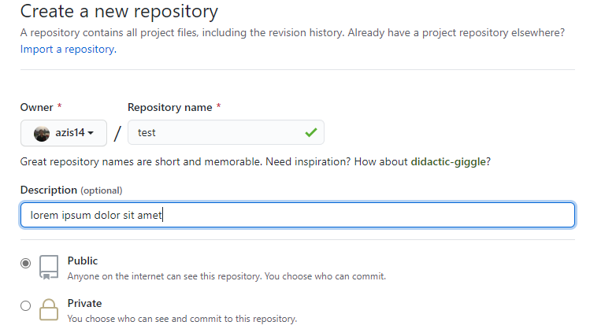
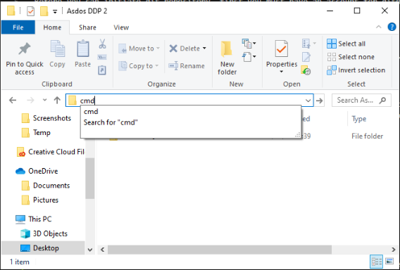
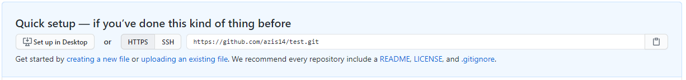

# Git Workflow

## How to Initiate Git Reository

Before you can initiate git repository, first you must have an account for github. If you don't have one, you can sign up [here](https://github.com/). You'll see screen like this.

If you already have an account for github, you can sign in and then click 'start a project' on your own dashboard page.

Fill in your repository name as free as you want (in case on this course, you can named your repository according to the task name given by lecturer). You also could write the description of your repository that makes you easier to remember for what this repository was created.

(Note: in this course, don't forget to makes your repository access to public. So your lecturer and asistant lecturer could look up to your repository)

Last, just hit on 'create repository' button and your repository will ready to use.

## How to Clone Repository from Github to Local Computer

You can clone repository from github using SSH or HTTPS, but in this course we reccomend you to use HTTPS to clone your repository to your local computer. First, go to folder where you want to locate your local repository. Then, open command prompt from that folder path. If you got confused, just type 'cmd' on the path bar in your folder.

After command promt opened, you could clone using HTTPS by copying the link on the top of your repository. Then, you could change your command prompt directory to the repository folder in your local computer.

> to clone your repository from github to local

~~~shell
git clone https://github.com/azis14/test.git
cd test
~~~