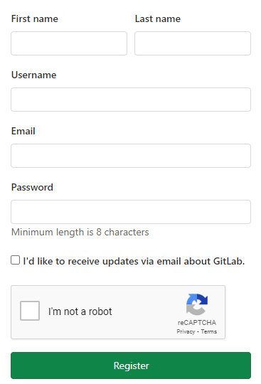
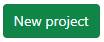
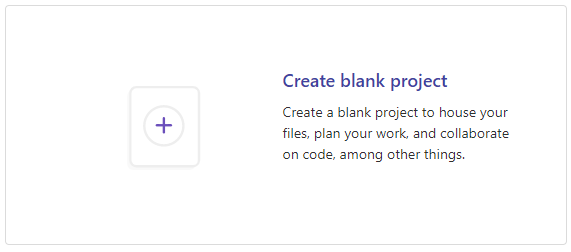
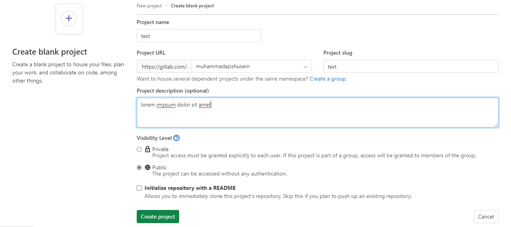
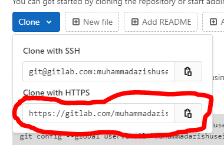

# Git Workflow

## How to Initiate Git Reository

Before you can initiate git repository, first you must have an account for gitlab. If you don't have one, you can sign up [here](https://gitlab.com/users/sign_up). You'll see screen like this.

If you already have an account for gitlab, you can sign in and then click 'new project' button on your own dashboard page.

Then choose create blank project.

Fill in your repository name as free as you want (in case on this course, you can named your repository according to the task name given by lecturer). You also could write the description of your repository that makes you easier to remember for what this repository was created.

(Note: in this course, don't forget to makes your repository access to private)

Last, just hit on 'create project' button and your repository will ready to use.

## How to Clone Repository from Gitlab to Local Computer

You can clone repository from gitlab using SSH or HTTPS, but in this course we reccomend you to use HTTPS to clone your repository to your local computer. First, go to folder where you want to locate in your local repository. Then, open command prompt from that folder path. If you got confused, just type 'cmd' on the path bar in your folder.

After command promt opened, you could clone using HTTPS by copying the link on the top of your repository. Then, you could change your command prompt directory to the repository folder in your local computer.

> To clone your repository from gitlab to local

~~~shell
git clone https://gitlab.com/muhammadazishusein/test.git
cd test
~~~

## How to Push Your Updates in Local to Gitlab

For example in your first time using git, just try to create markdown file named 'README.md' in your local repository.

> Fill README.md file with test

~~~markdown
# test
~~~

> Or you can type this on your command prompt

~~~shell
echo "# test" >> README.md
~~~

You also can create some another files such as Java or Python. If you have done editing this local repository and wanna push it to your gitlab repository, there are some steps to do it:

- Add your local changes (you can add all changes using '.' or you can add just one file by type its file name)
- Give commit message
- Push it to github

> Examples of pushing local changes to github

~~~shell
git add .
git commit -m "first commit"
git push origin master
~~~

If you have done, you could see your files are already available on gitlab repository.

## How to Pull Updates on Gitlab to Local Repository

In case you are work with your friends using git, sometimes you need to updates your local repository according to gitlab repository. You could updates your local repository by pulling the changes on your gitlab repository.

> To pull changes from github

~~~shell
git pull
~~~

Then, your local repository will be updated according to github repository.

## How to Create Branching

If you work with team using git, you can create new branch in order to avoid conflict updates when you push to gitlab or pull from gitlab. Conflict updates usually happend when you work together with your team and there are different updates exist on the same branch. So, better we avoid it using different branch.

> To create new branch and check out to your new branch

~~~shell
git branch myNewBranch
git checkout myNewBranch
~~~

> Or you can simply type like this

~~~shell
git checkout -b myNewBranch
~~~

> If you want to check your branch status

~~~shell
git status
~~~

While you are on your new branch, you could still operate git as usual as master branch. You could push to your new branch and pull from your new branch.

## How to Merge Updates on Your New Branch to Master

If you are done doing things on your new branch, you have to merge it to master branch so your work and your team's work could be integrated. Before merging your new branch to master branch, first you have to push your local updates to your repository branch on gitlab.

> Push as usual but not to master

~~~shell
git add .
git commit -m "Updates my branch"
git push origin myNewBranch
~~~

After you have push your local updates, you can go to master branch and merge it with your new branch updates.

> Checkout first

~~~shell
git checkout master
~~~

> Merge and push again

~~~shell
git merge myNewBranch
git push origin master
~~~

Now the master branch are updated with your new branch.

## How to Add Remote Upstream

In this course, you could add DDP 2 repository to be your upstream repository in order to pull every task updates. Before you can add remote upstream to DDP 2 repository, you have to create a blank repository first (without readme.md file). Then, clone that repository to your local computer. Now, you could add remote upstream to DDP 2 repositpry using CMD in your local repository directory.

> Add remote upstream

~~~shell
git add remote add upstream [DDP 2 repository https link]
git fetch upstream
git merge upstream/master
~~~

Now, you are already set DDP 2 repository to be your upstream master.